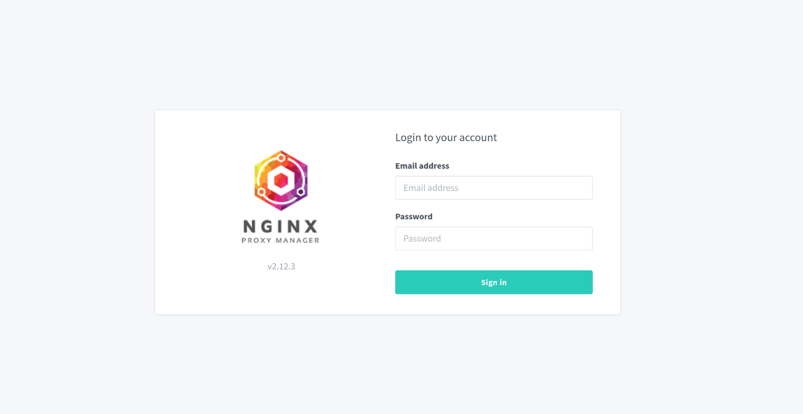
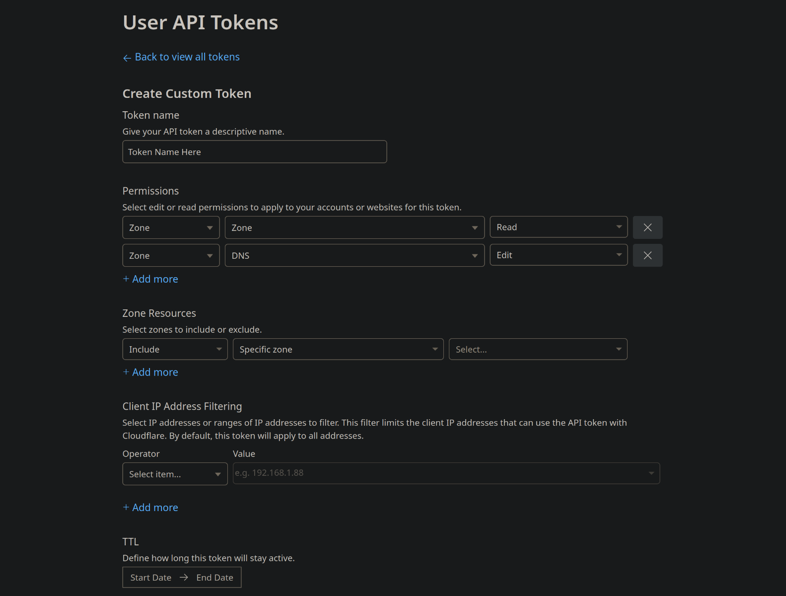
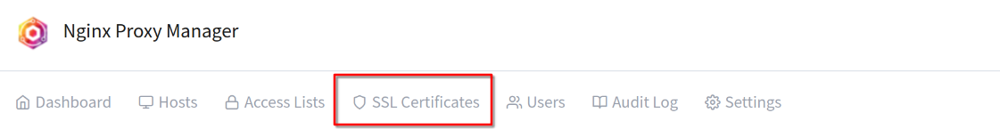
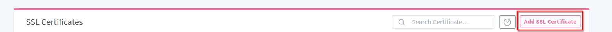
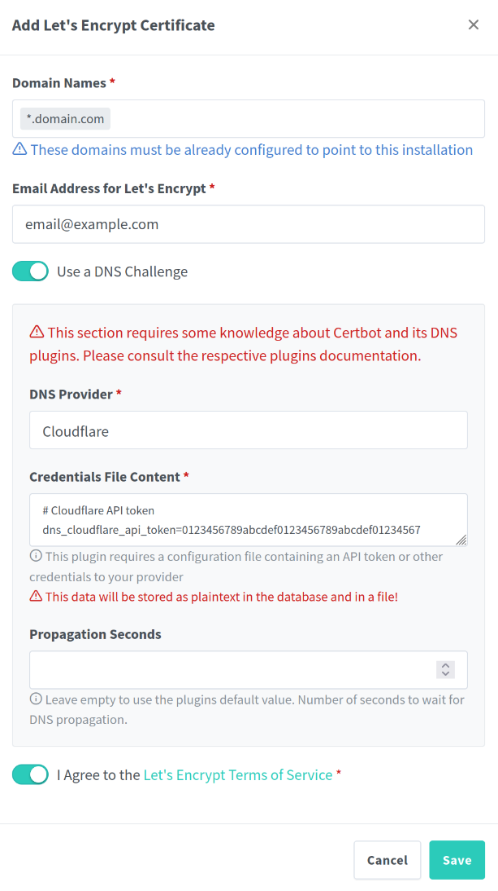
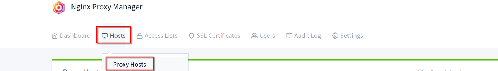
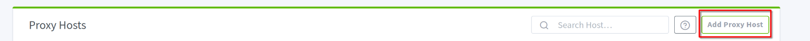
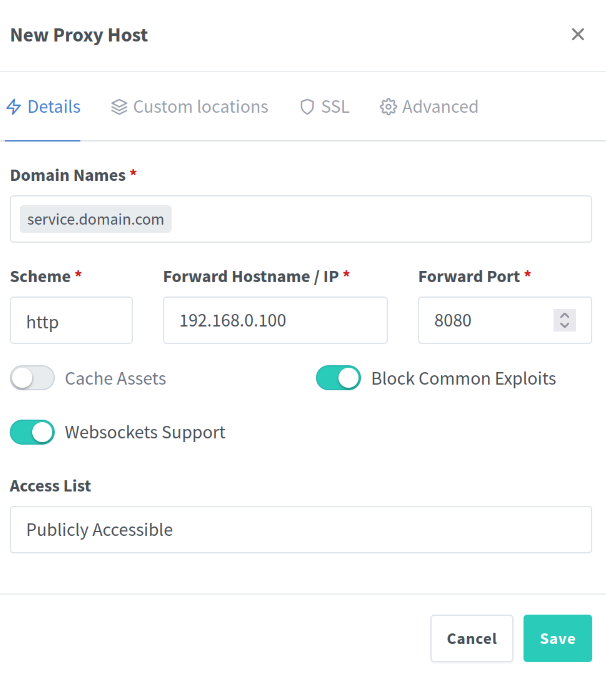
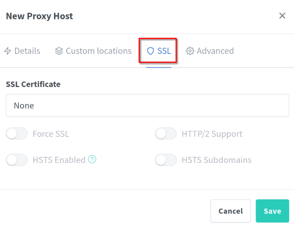

# Homelab SSL Certs

## Objective

This guide provides a concise overview of how I used [Nginx Proxy Manager](https://nginxproxymanager.com) to provision local SSL certificates via [Let's Encrypt](https://letsencrypt.org), configured a reverse proxy through Cloudflare, and integrated a custom domain to securely expose homelab services.

### Skills Learned

* SSL/TLS & Certificate Management

* Reverse Proxy Configuration

* DNS and Cloudflare Integration

* Network Security & Access Control

* Docker Container Deployment & Management 

### Tools Used

- Nginx Proxy Manager (NPM)

- Let's Encrypt

- Cloudflare

- Docker

- Portainer 

## Installing Nginx Proxy Manager

Installation was easy, I followed the documentation's [quick setup guide](https://nginxproxymanager.com/guide/) using the docker-compose.yml provided. Instructions if using Portainer like I am:

* Navigate to your server in Portainer then select `Stacks` -> `+ Add Stack` 

* Name the stack `nginx-proxy-manager`

* Select `Web editor`

* Copy paste the `docker-compose.yml` from the docs:

``` 
services:
  app:
  image: 'jc21/nginx-proxy-manager:latest
  container_name: nginxproxymanager
  restart: unless-stopped
  ports:
    - '80:80'
    - '81:81'
    - '443:443'
  volumes:
    - ./data:/data
    - ./letsencrypt:/etc/letsencrypt
```

* Select `Deploy the stack` 

* If the stack successfully deploys, you should be able to view the web portal at `http://SERVER_IP:81`



The web portal looks like this. The default credentals are `admin@example.com` and `changeme` for the Email address and Pasword fields respectively.

* Upon logging in you will be prompted to change the default credentials

## Setting up Reverse Proxy with Cloudflare DNS Challenge

### Obtaining a Domain

Previously I was using Caddy as a reverse proxy for one of my external services. While Caddy is lightweight and quick to spin up, NPM provides a clean GUI to easily manage many different proxies. I am going to quickly go over how to create a reverse proxy, but I highly recommend searching for a more in depth guide on this before exposing your service publicly. 

* The first step is purchase a domain name, ideally through [Cloudflare](cloudflare.com) or [namecheap](namecheap.com) or use a free service like [Duck DNS](duckdns.org). 

I like using Cloudflare to purchase the domain because it makes things a little bit easier, but you may be able to find cheaper domains on namecheap, and using duckdns is free but you will have always have .duckdns.org in your URL and the performance is usually bad. 

* Make a Cloudflare account

* Add your domain to Cloudflare

If you purchased your domain on Cloudflare, it should automatically be there. If you purchased it from a different site like namecheap, you'll need to put your Cloudflare nameservers in the configuration settings of your namecheap domain (or whatever service you purchased the domain from).

### DNS Records

* Under `Account Home` select your domain name -> `DNS` -> `Records` 

* Create an A record pointing at your public IP, the name will be your domain name (e.g. domain.com) and the IPv4 address will be your public IP. Under proxy status toggle to proxied (should show an orange cloud). Save that record

I recommend adding a CNAME record related to the service you're exposing (e.g. service.domain.com) or if you prefer traditional resolution you can do add www (e.g. www.domain.com) and just use the default domain. This is fully up to you.

* Add a CNAME record with the name you'd like to use, and have it point to your domain. Toggle proxy for this as well.

### Cloudflare API Token Generation

In order to use Cloudflare as our DNS Challenge, we need to generate an API token with appropriate permissions. 

* Log into your Cloudflare account

* In the top right hover over the person icon and select `Profile` 

* Along the left side, select `{} API Tokens` 

* Select `Create Token` 

* Create a `Custom Token` 

* Name the token 

* Under **Permissions** select `Zone` and to the right select `Zone` again, then select `Read` 

* Press `+ Add more` 

* Select `Zone` and to the right select `DNS` followed by `Edit` 

* Leave everything else as default and `Continue to Summary` (unless you have multiple domains, then you might want to restrict the Zone Resources)

* `Create Token` 

* Copy the token and save it somewhere safe, we will need it later



### SSL Certificates in NPM

Now you need to make sure you have port 443 forwarded in your router and server firewall. You do not need to forward port 80 when using the Cloudflare DNS challenge. Navigate to NPM web portal at `http://SERVER_IP:81` and log in. 

* Select `SSL Certificates` 



* Select `Add SSL Certificate` 



* Select `Let's Encrypt` 

* Under `Domain Names` type your domain name with a * in front (wildcard) e.g. `*.domain.com` and select it after so it appears in the gray box 

* Toggle `Use a DNS Challenge` 

* Choose `Cloudflare` as your `DNS Provider` 

* Input the Cloudflare API token that we generated earlier

* Agree to Let's Encrypt Terms of Service



* Save the Certificate 

Now we need to set the Proxy Host.

* Go to `Hosts` -> `Proxy Hosts`



* Select `Add Proxy Host`



* Put the name of CNAME record you created earlier (e.g. service.domain.com)

* Leave the scheme as `HTTP` 

* Under `Forward Hostname / IP` put the local IP of the server **OR** if running the service in a Docker container put the hostname of the Docker container. 

* Put the port the service uses

* Toggle `Block Common Exploits` 

* Research whether your service needs Websockets Support, if it does, toggle `Websockets Support` 



* Go to the `SSL` tab



* Select the wildcard SSL certificate we generated earlier.

* Toggle `Force SSL` 

* You may need to toggle `HTTP/2 Support` 

* Select `Save` 

You should see a new Proxy Host showing an online status. Under source, click on the domain name in the gray box, and see if you're able to connect to your service.

## Local SSL Certificates

Now we will go over how to use NPM and Cloudflare to create local SSL certs using our domain name. For a detailed overview I recommend watching [this](https://www.youtube.com/watch?v=qlcVx-k-02E) tutorial by Wolfgang's Channel. However that tutorial primarily uses Duck DNS, whereas I will be using Cloudflare. The one downside of using this method of generating local SSL certificates is that you will need connection to the internet for them to work. If this is a deal breaker, you should look into setting up a custom DNS such as [Pi-hole](https://pi-hole.net/). 

Personally, I chose to use seperate domains for public vs local services. This approach makes more sense to me, but you may want to use the same domain for both.

### Setting up Cloudflare DNS

* Navigate to the DNS records for your domain

* Add an **A** record with the root name of your domain e.g. `domain.com` 

* Point the A record to the **local** IP of your server e.g. `192.168.1.100`

* Do not proxy, use **DNS only** (gray cloud)

* Save the record

* Create a **CNAME** record 

* For the **Name** put `*` (wildcard)

* For the target put `@` aka the root domain e.g. `domain.com`

* Save the record

I chose to create a new API token with permissions for only my local domain, see the section above for how to create an API token.

### Local SSL Certificates

Follow the steps above in the **SSL Certificates in NPM** section with the following adjustments:

* When creating the SSL certificate, the name should have both the root domain and the wildcard for the root domain e.g. `domain.com` and `*.domain.com` 

* I chose to use seperate restricted API tokens for my public and local domains, make sure you the right one 

Now you need to create a new unique proxy host for each service you would like to have use the SSL cert. Here is an example for NPM itself:

* Create a new `Proxy Host`

* Name it `npm.domain.com` 

* For **Scheme** leave it as `http` 

* Under **Forward Hostname / IP** you can use the name of the Docker container `nginxproxymanager` or the local IP of the server e.g. `192.168.1.100` Under **Forward Port** put `81`

* Since this is a local service behind a firewall, we do not need to toggle `Block Common Exploits` but you can if you want

* NPM does not require `Websockets Support` so we may leave it off

* Go to the **SSL** tab and select the generated cert for your domain (ensure it's the right one if you have multiple)

* Toggle `Force SSL` and `HTTP/2 Support` on 

* Select **Save**

Now click the gray box that has `npm.domain.com` and it should load the NPM login portal with HTTPS and your domain name. If you adding other services and get an error like "Client sent an HTTP request to an HTTPS server" you need to switch the **Scheme** to `https` and make sure to research whether you need `Web Sockets` toggled on.

### Proxy Host Quirks

Some services may require **Advanced** settings or configuration changes, for example qBittorent:

- Scheme is set to **http**

- Forward port is **8080**

- "Websockets support" is **enabled**

- Stop the container

- In `qBittorrent.conf`, make sure:

```
WebUI\ReverseProxySupportEnabled=true
```

Then restart the container.

If you're still not able to access the web portal try adding these lines under **Advanced** in the proxy host settings:

```
proxy_set_header Host $host;
proxy_set_header X-Real-IP $remote_addr;
proxy_set_header X-Forwarded-For $proxy_add_x_forwarded_for;
proxy_set_header X-Forwarded-Proto $scheme;
```

#### qBittorent Lockout

If you attempt to access qBittorent through the NPM proxy without doing this, you will lock your account. If you did this then you need to:

Edit the file:

1. Stop the container.

2. Open the config file (`qBittorrent.conf`).

3. Find and delete (or comment out) these lines:

```
WebUI\Username=...
WebUI\Password_ha1=...
```

4. Also, make sure this is set (or add it):

```
WebUI\Address=0.0.0.0
WebUI\Port=8080
WebUI\CSRFProtection=false
WebUI\ReverseProxySupportEnabled=true
```

5. Save and restart the container.

6. Check the logs for new generated password (username will be admin).

7. Change your username/password upon logging in.

## Final Thoughts

Discovering Nginx Proxy Manager has been a game-changer for my homelab. I can now easily provision SSL certificates for any service I deploy, eliminating the need to access them over insecure HTTP. Instead of relying on IP addresses and port numbers, I now use a professional-looking, easy-to-remember domain name, making my setup both more secure and more user-friendly.


